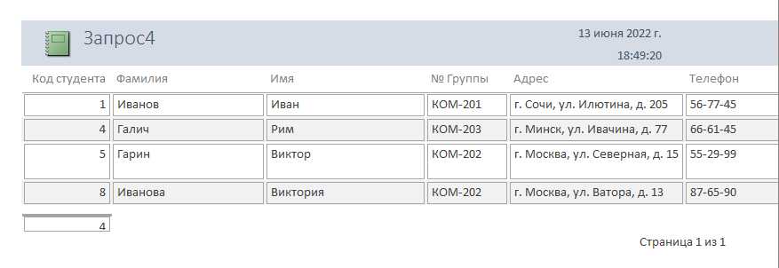

# Laboratory work on Access No. 1

[[лаба 1.docx](https://github.com/MaksusLord/MyRepozitoriy/blob/main/лаба%201.docx)]

| Number | Task | Screenshot |
|:------:|:----------|----------|
| 1 | Run Access and create a new database. |  |
| 2 | Create a layout of a table containing the following fields: Student Code, Surname, First Name, Group, Address, Phone, Photo, Notes. |  |
| 3 | To enter data into the table, create an autoform in a column named Form. |  |
| 4 | Edit the form: the text fields are located in the column on the left one under the other, place the photo and notes on the right one under the other. |  |
| 5 | To view the table entries, create a ribbon form using the Form Wizard, without including photos and notes in it. |  |
| 6 | Perform database-specific operations in this form and create reports. |  |
| 6.1 | Report 1 |  |
| 6.2 | Report 2 |  |
| 6.3 | Report 3 |  |
| 6.4 | Report 4 |  |
